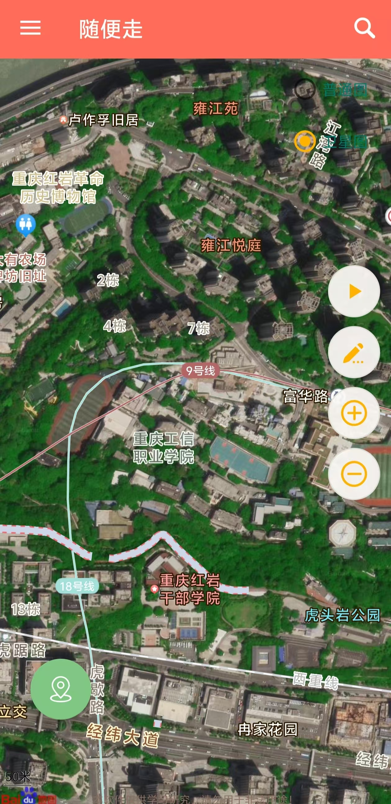
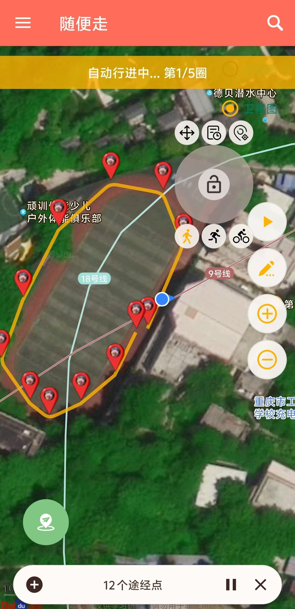

# Go2Go 🌍

[](https://developer.android.com/)
[](https://github.com/gongjiantao/Go2Go/releases)
[](LICENSE)

> 一款基于百度地图 SDK 开发的 Android 位置模拟与足迹记录工具，支持地图选点、路线模拟、摇杆控制和历史足迹记录，适用于开发调试、地图功能测试与定位相关学习研究。

## 项目介绍

**Go2Go** 是一款 Android 模拟定位工具，主要用于帮助开发者、测试人员或学习者在合法场景下进行位置相关功能调试。

在实际开发中，很多 App 都会涉及定位能力，例如地图展示、附近搜索、位置上报、轨迹记录、导航模拟等。如果每次测试都依赖真实移动，不仅效率低，而且不方便复现问题。Go2Go 的作用就是提供一个更直观、更轻量的位置模拟环境，让用户可以通过地图选点、路线规划、摇杆控制等方式完成定位测试。

本项目 fork 自 [ZCShou/GoGoGo](https://github.com/ZCShou/GoGoGo)，并在原项目基础上进行了 UI 重构、功能修复和体验优化。感谢原作者的开源贡献。

## 功能特点

* 📍 **地图选点定位**
  可在地图上选择任意位置，并将其作为模拟定位点。

* 🔍 **地点搜索**
  支持通过百度地图搜索地点，快速定位到目标区域。

* 🧭 **自动路线模拟**
  支持添加多个途经点，按照设定路线进行自动移动模拟。

* 🎮 **悬浮摇杆控制**
  通过屏幕悬浮摇杆控制移动方向和速度，适合手动微调位置。

* 📜 **足迹记录**
  自动记录历史模拟位置，方便后续快速查看和再次使用。

* 🎨 **界面优化**
  对应用界面进行了重新设计，整体更加简洁、直观、易用。

* ⚡ **体验优化**
  优化部分交互逻辑，修复若干使用过程中的异常问题，提高运行稳定性。

## 使用场景

Go2Go 适合用于以下场景：

* Android 定位功能开发调试
* 地图 SDK 学习与测试
* 位置上报功能验证
* 路线轨迹模拟测试
* 软件测试课程或项目实训
* 个人学习 Android 定位机制

> 本项目仅建议用于学习研究、开发调试和合法测试场景，请勿用于违反法律法规、平台规则或侵犯他人权益的行为。

## 运行环境

* Android 7.0 及以上
* Android Studio
* JDK 11 或兼容版本
* 百度地图 Android SDK
* 已开启 Android 开发者选项
* 已允许选择模拟位置信息应用

## 快速开始

### 1. 克隆项目

```bash
git clone https://github.com/gongjiantao/Go2Go.git
```

### 2. 使用 Android Studio 打开项目

打开 Android Studio，选择：

```text
File -> Open -> Go2Go
```

等待 Gradle 自动同步完成。

### 3. 配置百度地图 AK

本项目使用百度地图 SDK，需要前往百度地图开放平台申请 Android SDK 密钥：

```text
https://lbsyun.baidu.com/
```

申请完成后，将你的 AK 配置到项目对应位置。

常见配置位置一般在：

```xml
<meta-data
    android:name="com.baidu.lbsapi.API_KEY"
    android:value="你的百度地图AK" />
```

> 注意：真实项目中不建议把个人 AK、密钥等敏感信息直接提交到公开仓库。

### 4. 开启模拟定位权限

在 Android 手机中打开：

```text
设置 -> 关于手机 -> 连续点击版本号开启开发者选项
```

然后进入：

```text
开发者选项 -> 选择模拟位置信息应用 -> 选择 Go2Go
```

### 5. 编译运行

连接真机或启动模拟器后，在 Android Studio 中点击：

```text
Run
```

即可安装并运行项目。

## 技术栈

* 开发语言：Java
* 开发平台：Android
* 地图能力：百度地图 SDK
* 数据存储：SQLite / SharedPreferences
* 后台能力：Service
* UI 设计：Material Design 风格
* 定位能力：Android Mock Location

## 相比上游项目的改动

本项目在原 GoGoGo 项目基础上主要进行了以下调整：

* 重构部分界面样式，使整体视觉更现代、更统一
* 优化按钮、卡片、侧边栏等 UI 组件
* 增加或优化部分交互动画
* 修复自动路线模拟中的部分异常问题
* 修复部分设备首次启动或切换状态时的稳定性问题
* 清理部分冗余代码和无用布局
* 优化提示文案，提高新手使用体验
* 补充项目说明文档，方便后续维护和学习

## 项目截图

| 欢迎页 | 主地图 | 路线模拟 |
| :---: | :---: | :---: |
|  |  |  |

## 注意事项

1. 使用前需要开启 Android 开发者选项。
2. 使用前需要在系统中选择 Go2Go 作为模拟位置信息应用。
3. 百度地图 AK 需要自行申请并正确配置。
4. 部分手机系统可能会限制后台定位或悬浮窗权限，需要手动开启相关权限。
5. 不同 Android 版本、不同厂商系统的权限入口可能略有差异。
6. 本项目仅用于学习研究、开发调试和合法测试，不鼓励任何违规使用。

## 免责声明

本项目仅供学习研究、开发调试和合法测试使用。

使用者应遵守所在地区法律法规、应用平台规则以及相关服务协议。因使用者将本项目用于违规、违法或其他不当用途而产生的任何后果，均由使用者自行承担，项目作者不承担相关责任。

下载、安装、运行或使用本项目，即表示你已理解并同意上述说明。

## 贡献说明

欢迎提交 Issue 或 Pull Request，一起改进项目。

你可以参与以下方向：

* 修复 Bug
* 优化 UI
* 改进交互体验
* 补充项目截图
* 完善使用文档
* 适配更多 Android 版本
* 优化百度地图相关功能

## 致谢

感谢原项目作者的开源贡献：

* [ZCShou/GoGoGo](https://github.com/ZCShou/GoGoGo)

本项目在原项目基础上继续学习、修改和优化。

## 项目地址

```text
https://github.com/gongjiantao/Go2Go
```

---

如果这个项目对你有帮助，欢迎点一个 Star ⭐

*For English version, see [README_EN.md](README_EN.md)*
