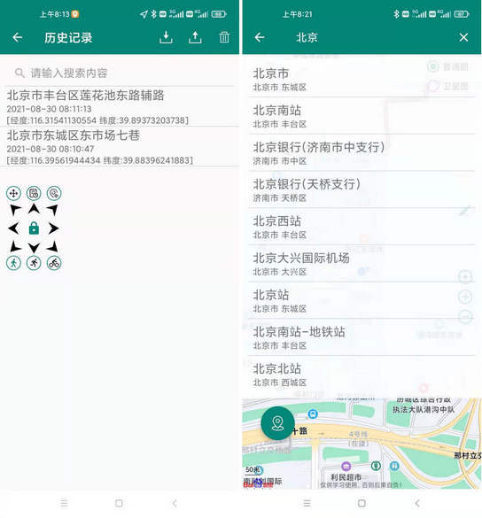
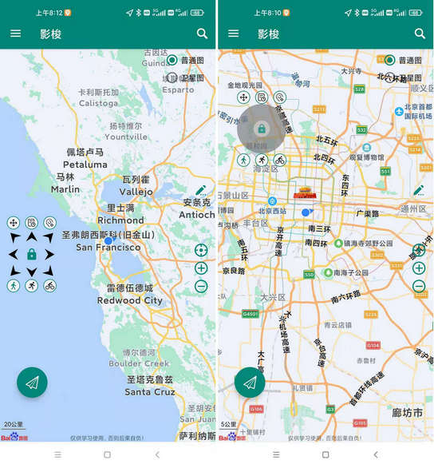
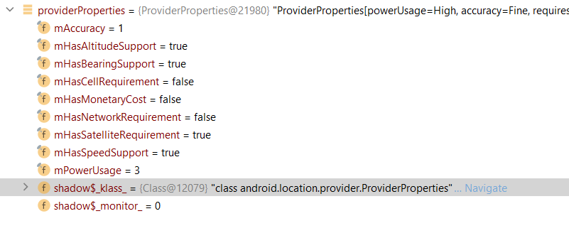
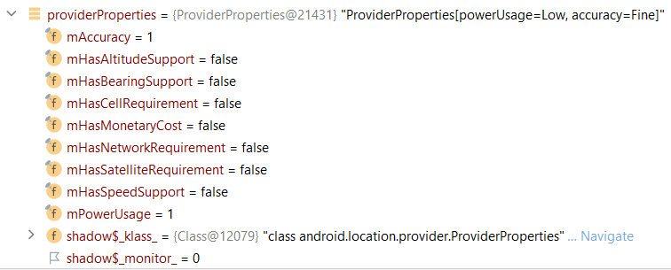

# Go2Go 🌍

[](https://developer.android.com/)
[](https://github.com/gongjiantao/Go2Go/releases)
[](LICENSE)

> An Android location simulation and footprint tracking tool built on Baidu Maps SDK. Supports map point selection, route simulation, joystick control, and history tracking — ideal for development, debugging, and location-related learning.

## Overview

**Go2Go** is an Android mock location tool designed to help developers, testers, and learners debug location-based features in legitimate scenarios.

Many apps rely on location capabilities — map display, nearby search, location reporting, trajectory recording, navigation simulation, and more. Depending on real-world movement for every test is inefficient and makes issues hard to reproduce. Go2Go provides an intuitive, lightweight location simulation environment where users can complete location testing through map selection, route planning, and joystick control.

This project is forked from [ZCShou/GoGoGo](https://github.com/ZCShou/GoGoGo), with UI redesign, bug fixes, and UX improvements on top of the original work. Thanks to the original author for the open-source contribution.

## Features

* 📍 **Map Point Selection**
  Pick any location on the map and use it as a simulated position.

* 🔍 **Place Search**
  Search for locations via Baidu Maps to quickly navigate to target areas.

* 🧭 **Auto Route Simulation**
  Add multiple waypoints to create a path and simulate automatic movement along the route.

* 🎮 **Floating Joystick Control**
  Control movement direction and speed via an on-screen floating joystick, ideal for fine-tuning position manually.

* 📜 **Footprint History**
  Automatically saves previously used locations for easy revisiting and quick re-use.

* 🎨 **UI Redesign**
  A cleaner, more modern, and more intuitive interface.

* ⚡ **Stability Improvements**
  Optimized interaction flows and fixed several runtime issues for a more stable experience.

## Use Cases

Go2Go is suitable for:

* Android location feature development and debugging
* Map SDK learning and testing
* Location reporting feature verification
* Route and trajectory simulation testing
* Software testing coursework or project training
* Personal learning of Android location mechanisms

> This project is recommended for learning, research, development debugging, and legitimate testing only. Do not use it for activities that violate laws, platform policies, or the rights of others.

## Requirements

* Android 7.0 (API 24) or above
* Android Studio
* JDK 11 or compatible
* Baidu Maps Android SDK
* Developer options enabled
* Mock location app permission granted

## Quick Start

### 1. Clone the Repository

```bash
git clone https://github.com/gongjiantao/Go2Go.git
```

### 2. Open in Android Studio

Launch Android Studio, then:

```text
File -> Open -> Go2Go
```

Wait for Gradle sync to complete.

### 3. Configure Baidu Maps API Key

This project uses the Baidu Maps SDK. You'll need to apply for an Android SDK key on the Baidu Maps Open Platform:

```text
https://lbsyun.baidu.com/
```

Once obtained, configure your API key in the project. The typical configuration location is:

```xml
<meta-data
    android:name="com.baidu.lbsapi.API_KEY"
    android:value="your_baidu_api_key" />
```

> Note: Do not commit personal API keys or other sensitive information to public repositories.

### 4. Enable Mock Location Permission

On your Android device:

```text
Settings -> About Phone -> Tap "Build Number" 7 times to enable Developer Options
```

Then:

```text
Developer Options -> Select Mock Location App -> Choose Go2Go
```

### 5. Build and Run

Connect a real device or launch an emulator, then click:

```text
Run
```

in Android Studio to install and run the project.

## Tech Stack

* Language: Java
* Platform: Android
* Maps: Baidu Maps SDK
* Data Storage: SQLite / SharedPreferences
* Background: Service
* UI Design: Material Design
* Location: Android Mock Location

## Changes from Upstream

Compared to the original GoGoGo project, this version includes:

* Redesigned UI for a more modern, consistent look
* Improved buttons, cards, sidebar, and other UI components
* Added and refined interaction animations
* Fixed issues in automatic route simulation
* Fixed stability issues on certain devices during first launch or state switching
* Cleaned up redundant code and unused layouts
* Improved user-facing prompts and instructions
* Enhanced project documentation for easier maintenance and learning

## Screenshots

| Welcome | Main Map | Route Simulation |
| :---: | :---: | :---: |
|  |  |  |

| Search History | Joystick | GPS Service |
| :---: | :---: | :---: |
|  |  |  |

| Location Options | App Icon |
| :---: | :---: |
|  |  |

## Notes

1. Android Developer Options must be enabled before use.
2. Go2Go must be selected as the mock location app in system settings.
3. A valid Baidu Maps API key is required and must be configured correctly.
4. Some devices may restrict background location or overlay permissions — grant them manually if prompted.
5. Permission menus may vary slightly across Android versions and manufacturer skins.
6. This project is intended for learning, research, development debugging, and legitimate testing only.

## Disclaimer

This project is provided for learning, research, development debugging, and legitimate testing purposes only.

Users must comply with applicable laws, platform rules, and service agreements. The project author assumes no liability for any consequences resulting from improper, illegal, or unauthorized use of this software.

By downloading, installing, running, or using this project, you acknowledge that you have read and agree to the above terms.

## Contributing

Issues and Pull Requests are welcome to help improve the project.

Areas you can contribute to:

* Bug fixes
* UI improvements
* Interaction enhancements
* Adding screenshots
* Improving documentation
* Supporting more Android versions
* Optimizing map-related features

## Acknowledgements

Thanks to the original project author:

* [ZCShou/GoGoGo](https://github.com/ZCShou/GoGoGo)

This project continues to learn from, modify, and build upon the original work.

## Links

```text
https://github.com/gongjiantao/Go2Go
```

---

If this project helps you, consider giving it a Star ⭐

*中文说明请查看 [README.md](README.md)*
